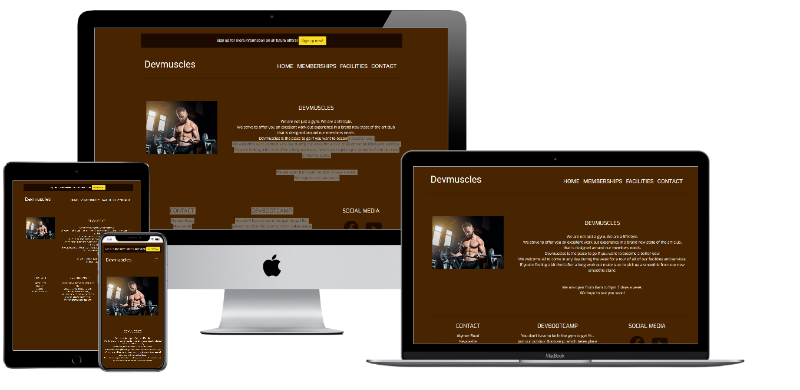
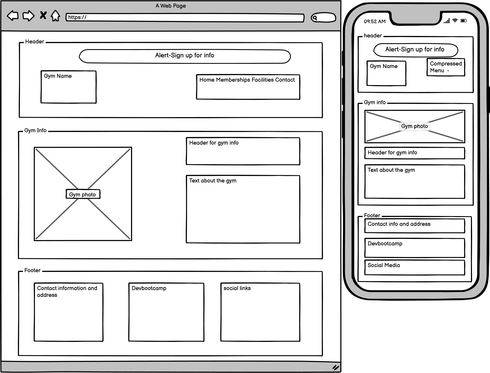
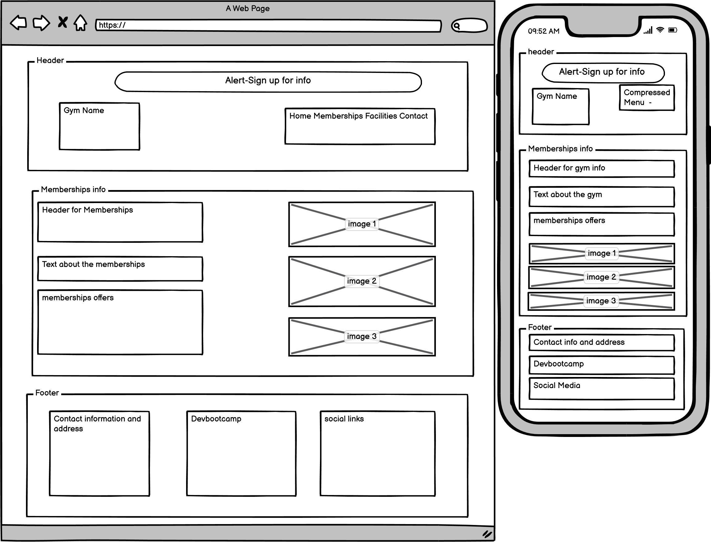
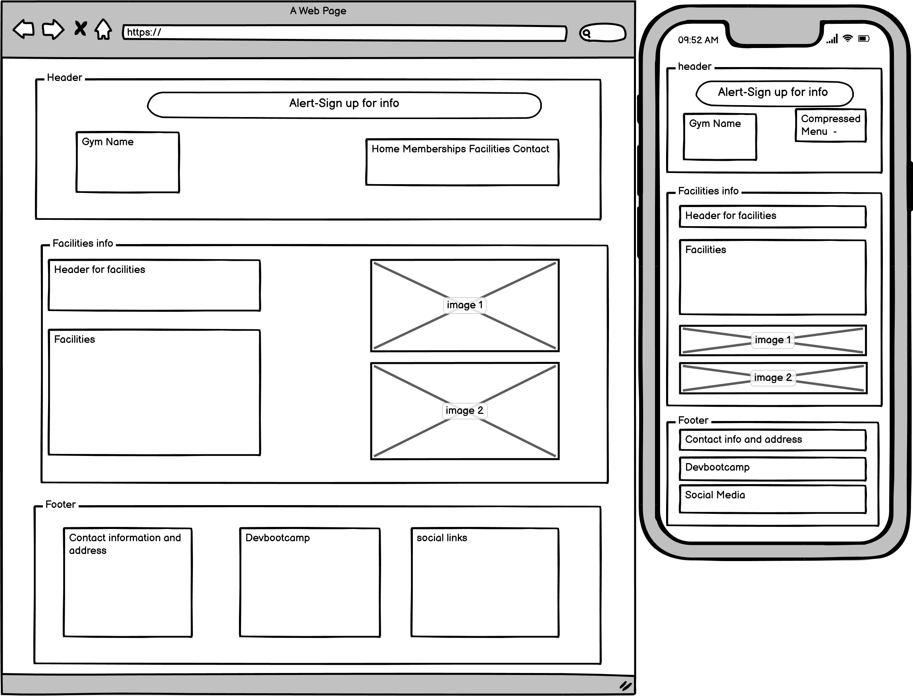
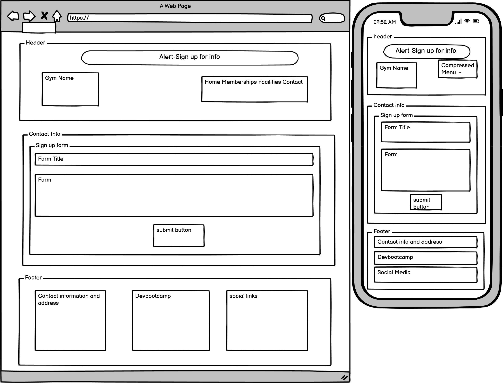
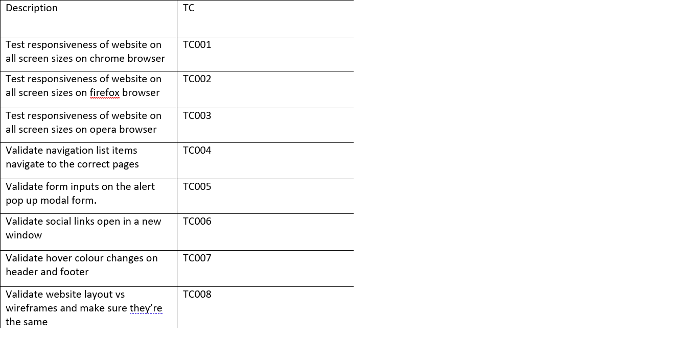
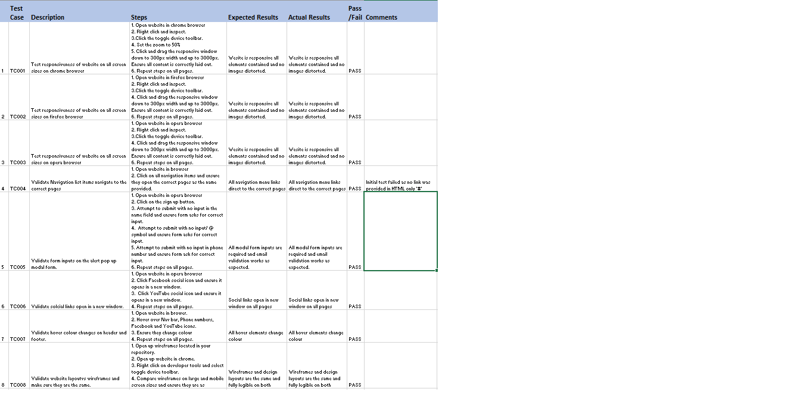

# Devmuscles
## Table of Contents
* [Objective](#Objective)
* [User Experience Design (UX)](#User-Experience-Design)
  * [User stories](#User-Stories)
    * [First Time Visitor Goals](#First-Time-Visitor-Goals)
    * [Returning Visitor Goals](#Returning-Visitor-Goals)
    * [Frequent User Goals](#Frequent-User-Goals)
  * [Structure](#Structure)
  * [Design](#Design)
    * [Colour Scheme](#Colour-Scheme)
    * [Imagery](#Imagery)
    * [Wireframes](#Wireframes)
* [Limitations](#Limitations)
- [Features](#Features)
* [Technologies](#Technologies)
* [Testing](#Testing)
    * [Test Strategy](#Test-Strategy)
      * [Summary](#Summary)
      * [Test Cases](#Test-Cases)
    * [Test Results](#Test-Results)
* [Deployment](#Deployment)
    * [GitHub Pages](#Using-Github-Pages)
* [Credits](#Credits)
  * [Content](#Content)
  * [Images](#Images)
  * [Acknowledgements](#Acknowledgements)
  * [Git Commits](#Git-Commits)

# Milestone Project 1
## Objective
The objective of my first Milestone Project was to complete a website as part of the Code Institute's Full Stack Developer course.
The website must be built using knowledge gained from HTML,CSS and User Centric Design modules.

The live website can be found [here](https://dylanocallaghan.github.io/MS1/index.html).

# Devmuscles Website

The Devmuscles website was built to meet certain goals set in Project Example Idea 2, which is to build a website for a gym. 
The website also took into consideration the external user's goal of supplying relevant information to current gym members and recruiting potiential members.
The client expressed the need to entice new members who would like to learn more about the gym and its procedures. Their main goal is to attract new members 
while retaining current members of the gym. 

***
## User Experience Design 

### User Stories
#### First Time Visitor Goals
* As a First Time user, I want to easily understand the main purpose of the site and learn more about the gym.
* As a First Time user, I want to be able to easily navigate throughout the site to find content.
* As a First Time user, I want to view the website and content clearly on a mobile device.
* As a First Time user, I want to find ways to follow Devmuscles on different social media platforms.
* As a First Time user, I want the page to load quickly so that I don't lose interest.
#### Returning Visitor Goals
* As a Returning user, I want to be able to contact Devmuscles to ask questions and find more information.
* As a Returning user, I want to find the address and opening hours of the gym.
#### Frequent User Goals
* As a Frequent user, I want to check to see if there are any new or upcoming offers.
* As a Frequent user, I want to check the equipment and facilities within the gym.
* As a Frequent user, I want to sign up to the Newsletter so that I am emailed any major updates and/or changes to the website or gym's interior.
### Structure
The key element on every page of the website is the Navigation menu at the top of the webpage. This Navigation Menu is also collapsable on mobile devices 
to ensure that this feature functions efficiently on the smaller screen. The Navigation menu is essential as it enables users to quickly find what they're 
looking for and navigate the site with ease.

The purpose of this is to fulfill user story:
> As a First Time user, I want to be able to easily navigate throughout the site to find content.

The Home Page will contain a short paragraph detailing the background of the club.

The purpose of this is to fulfill user story:
> As a First Time user, I want to easily understand the main purpose of the site and learn more about the gym.

All pages will be responsive and the layouts will change depending on whether you are using a PC or mobile device. This is to ensure that the content 
is always readable and the images are displayed properly. By doing this we avoid shrinking the text or images so much that the user cannot read them. 

The purpose of this is to fulfill user story:
> As a First Time user, I want to view the website and content clearly on my mobile device.

All pages will contain a Footer Element with Contact Information, Devbootcamp information and Social Media Icons. The icons used will be
from font-awesome. These are referenced below in the Technologies section of this document. 

The purpose of the Footer elements is to fulfill user stories:
> As a First Time user, I want to find ways to follow Devmuscles on different social media platforms. 
> As a Returning user, I want to be able to contact Devmuscles to ask questions and for more information.  
> As a Returning user, I want to find the address and opening hours of the gym.

The About Page will contain a short paragraph about the gym, opening hours, information on how to get a tour of the gym and information on our smoothie
 stand.

The purpose of this page is to help apply user story:
> As a First Time user, I want to easily understand the main purpose of the site and learn more about the gym.

The Memberships Page will contain information on prices and deals available to different age groups.. 

The purpose of this page is to fulfill user stories:
> As a Returning user, I want to be able to contact Devmuscles to ask questions and for more information. 
> As a Frequent user, I want to check to see if there are any new upcoming offers.

The Facilities Page will contain images and information on the facilities and equipment available within the gym.

The purpose of this page is to fulfill user stories:
> * As a Frequent user, I want to check the equipment and facilities within the gym.

The Contact Page will feature a form that allows the user to input their contact details. The form will also contain a check 
box that allows the user to sign up for the Clubs newsletter in order to receive updates from the club.

The purpose of this Page is to fulfill user stories:
> As a Returning user, I want to contact the organisation so I can request more information. 
> As a Frequent user, I want to sign up to the Newsletter so that I am emailed any major updates and/or changes to the website or organisation.

On the top of every page, users can interact with an alert feature. As a result of this interaction a modal form will open up to allow the user to input
 their information to be contacted by Devmuscles.

### Design
#### Colour Scheme
The two main colours used are brown and an off shade of Black as these colours create a nice contrast. They also correspond with Devmuscles icon, as 
illustrated below. 
 
 

#### Imagery
Images are important to Devmuscles, they are used in the website to show the inside of the gym, gym equipment available, and sample photos of members 
working out. Devmuscles prefers to keep their images as generic as possible, as they respect their members privacy as they begin their fitness journey. 
They also want to ensure that the gym appears as inclusive as possible by giving the potential member an insight into who they are and the workout space on
offer.
#### Wireframes
#### Home Page 
 
#### About Page 
 
#### Facilities Page 
 
#### Contact Page 
 

For full size PDF's of the wireframes, please click the links below
* [Home Page Wireframe](assets/wireframes/home.pdf)

* [About Page Wireframe](assets/wireframes/about.pdf)

* [Events Page Wireframe](assets/wireframes/events.pdf)

* [Gallery Page Wireframe](assets/wireframes/home.pdf)

* [Contact Page Wireframe](assets/wireframes/home.pdf)

### Limitations
As there is no JavaScript functionality, apart from Bootstraps(JS/JQuery) which is used for the Modal Form, as outlined in the Frameworks Libraries and 
Programs Used section, the contact forms will not store data or send email requests.
***
## Features
 
- Alert- This alert allows users to input contact information by opening up a modal form.
- Contact Form - This can be completed on the contact.html page and used in order to contact the gym with any queries users may have.
***
## Technologies

* HTML
	* HTML is used as the main language to complete the structure of the Website.
* CSS
	* Custom written CSS is used to style the Website.
* [Bootstrap](https://getbootstrap.com/)
	* The Bootstrap framework is used throughout this website for layouts and styling. 
	* This framework is also used to import JavaScript/Query used for the Sign Up alert.
* [Font Awesome](https://fontawesome.com/)
	* Font awesome Icons are used for the Social media links contained in the Footer section of the website.
* [Google Fonts](https://fonts.google.com/)
	* Google fonts are used throughout the project to import the *Exo* and *Roboto* fonts.
* [GitHub](https://github.com/)
	* GitHub is the hosting site used to store the source code for the Website and [Git Pages](https://pages.github.com/) is used for the deployment of
     the live site.
* [Git](https://git-scm.com/)
	* Git is used as version control software to commit and push code to the GitHub repository where the source code is stored.
* [Google Chrome Developer Tools](https://developers.google.com/web/tools/chrome-devtools)
	* Google chromes built in developer tools are used to inspect page elements and help debug issues with the site layout and test different CSS styles.
* [balsamiq Wireframes](https://balsamiq.com/wireframes/)
	* This was used to create wireframes for 'The Skeleton Plane' stage of UX design.
* [Favicon](https://favicon.io/)
    * Favicon.io was used to make the site favicon 
* [Techsini](http://techsini.com/multi-mockup/index.php)
    * tecnisih.com Multi Device Website Mockup Generator was used to create the Mock up image in this README
***
## Testing

### Test Strategy 

#### Summary 

Testing is required on MilestoneProject-1
As this project is static and contains no back-end functionality, the testing performed will be focused on the visual effects and layout of the Website. 
The testing will be carried out on at least three web browsers and all screen sizes.
No elements should overlap another container div. 

All nav links should direct to the correct html pages. The Home page is the exception, this one will go to index.html. 

All links to external websites must open in a new browser.

Testing of form validation will also be required to ensure that the correct inputs are taken and that all fields are required. 

Validation to ensure the inclusion of all features in the Structure of the Website / Wireframes must be performed.

The live Project can be found [here](https://dylanocallaghan.github.io/MS1/index.html). 

#### Test Cases

### Test Results

All Pages were run through the W3C HTML Validator and showed no errors.  
CSS Stylesheet was run through the W3C CSS Validator and showed no errors. 
Website was tested by running locally and tested on the deployed version. No differences found.

## Deployment

### Run Locally
1. Navigate to the GitHub [Repository:](https://github.com/dylanocallaghan/MS1)
1. Click the Code drop down menu.
1. Either Download the ZIP file, unpackage locally and open with IDE (This route ends here) OR Copy Git URL from the HTTPS dialogue box.
1. Open your development editor of choice and open a terminal window in a directory of your choice.
1. Use the 'git clone' command in terminal followed by the copied git URL.
1. A clone of the project will be created locally on your machine.

### Using Github Pages
1. Navigate to the GitHub [Repository:](https://github.com/dylanocallaghan/MS1)
1. Click the 'Settings' Tab.
1. Scroll Down to the Git Hub Pages Heading.
1. Select 'Master Branch' as the source.
1. Click the Save button.
1. Click on the link to go to the live deployed page.

***
## Credits
### Content
The content of the website was created by Dylan O'Callaghan using similar gym websites for inspiration. 

### Images  
The images used are from different gym advertisements found online.

### Acknowledgements
I'd like to thank my mentor Spencer Baribell for his guidance throughout my project. 
I'd especially like to thank Spencer Baribell for helping with the code for the collapsable Nav bar on mobile devices. 
Thanks to Daisy McGirr for providing me with the Readme file template and assisting with html/css problems. 

## Git Commits

I accidentally made two initial commits and I can't rename the commits, the only difference between the two commits is that I added an index.html 
and a basic start to my html.